# 츄애니원 (애니메이션 추천 서비스)

[TOC]

📆 **프로젝트 진행기간 : 2022/08/22 - 2022/10/07** 

🎈 **팀원소개**

| 이름   | 역할               |
| ------ | ------------------ |
| 금동운 | BigData & Frontend |
| 박유주 | Backend            |
| 안세영 | Backend & Server   |
| 이소영 | BigData & Backend  |
| 이승현 | Frontend           |
| 장창완 | Frontend           |

📽 [**UCC 보러가기**](https://youtu.be/oGQ1oaCvIBA)

---

## 01 서비스 소개

> #### 애니메이션 빅데이터 추천 서비스
>
> "츄애니원"은 유저들의 선호도를 기반으로 잠재요인의 값을 구하여 
>
> 각각의 유저에게 애니메이션을 맞춤형으로 제공하는 서비스이다.

---

## 02 주요 기능

✔ 애니메이션 추천

✔ 애니메이션에 대한 정보와 리뷰, 톡톡을 통한 소통공간

✔ 유저가 본 애니메이션을 분석하여 만든 일본어 단어장

✔ 취향이 비슷한 사람들과 소통의 공간, 오픈채팅

---

## 03 "츄애니원" 서비스 화면

#### **회원가입 및 로그인**

✨ **회원가입**

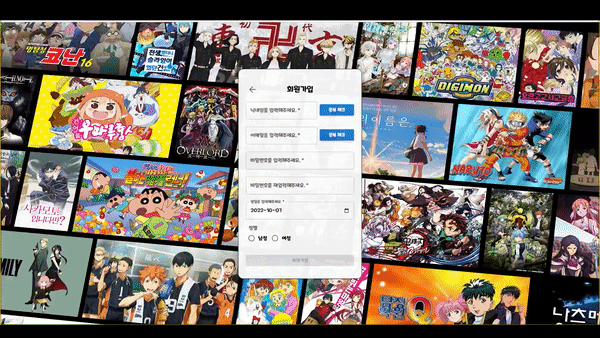

✨ **로그인**

✨ **비밀번호 찾기**

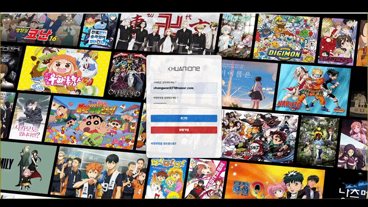

---

#### 마이페이지

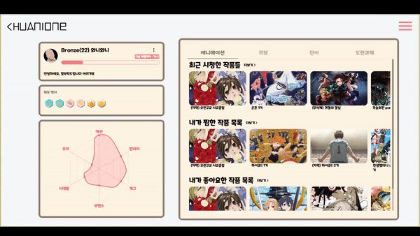

✨ **애니메이션**

✨ **리뷰**

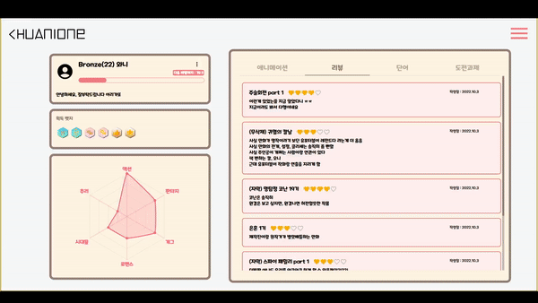

✨ **일본어 단어장**

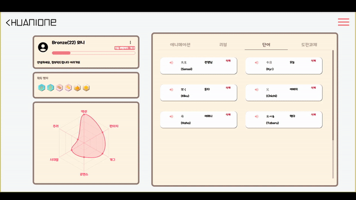

✨ **회원정보 변경**

---

#### 메인페이지

---

#### 소개페이지

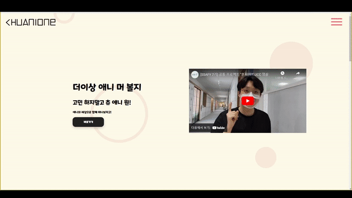

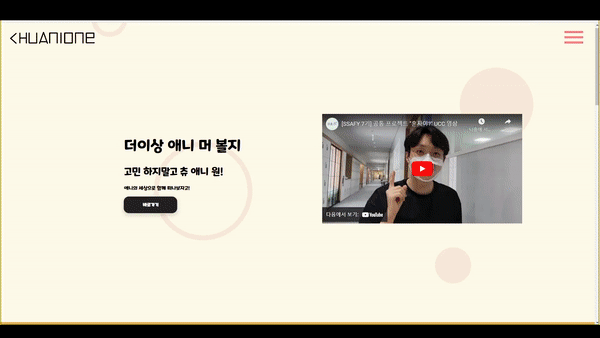

---

#### 검색페이지

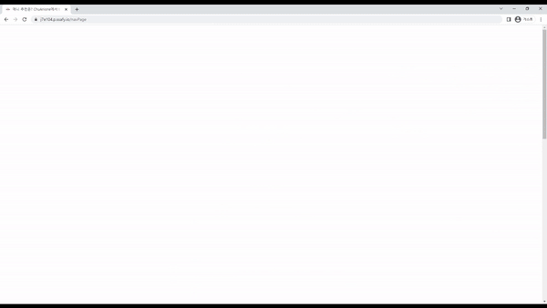

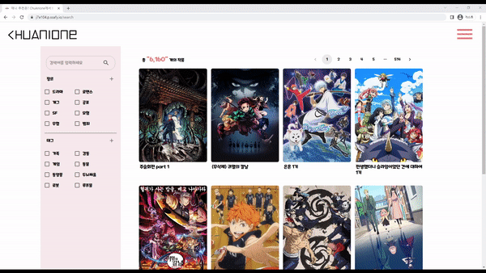

---

#### 상세페이지

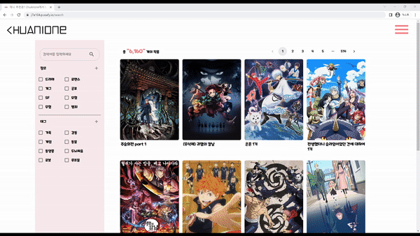

✨ **리뷰**

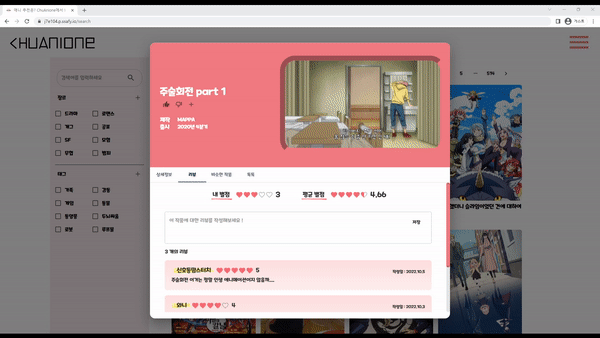

**✨ 톡톡**

---

#### 오픈채팅

**✨ 방만들기**

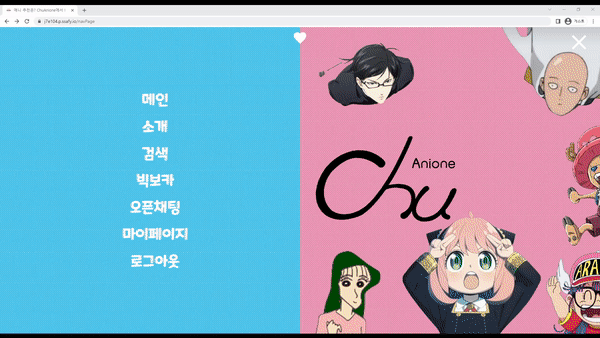

**✨ 채팅방 입장/퇴장**

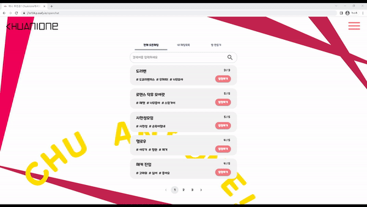

**✨ 채팅**

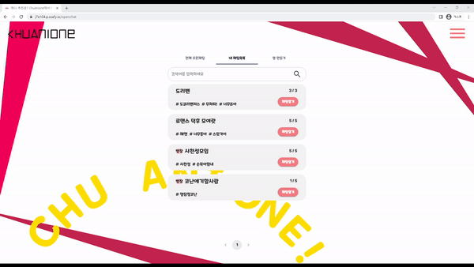

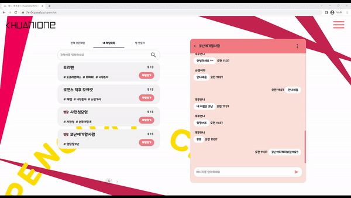

**✨ 채팅방 정보 수정**

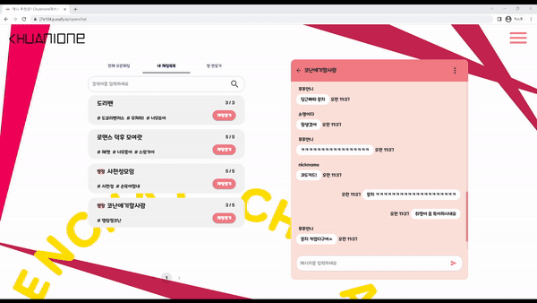

**✨ 채팅방 삭제**

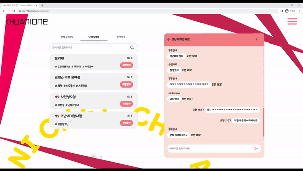

---

#### 빅보카

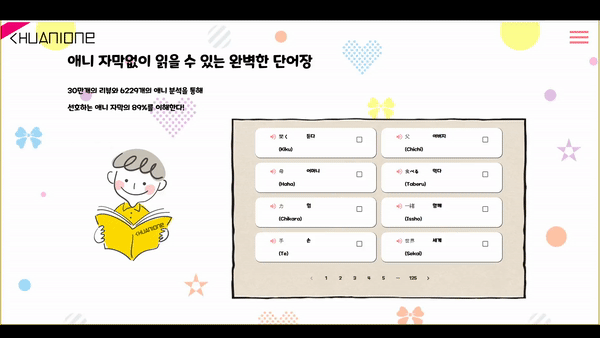

---

## 04 개발환경

📌 **Backend**

📌 **Frontend**

- VSCode (IDE)
- react 18.2.0
- react-canvas-confetti 1.3.0
- react-chartjs-2 4.3.1
- react-dom 18.2.0
- react-material-ui-carousel 3.4.2
- react-player 2.10.1
- react-redux 8.0.2
- react-router-dom 6.3.0
- redux 4.2.0
- redux-persist 6.0.0
- redux-thunk 2.4.1
- sockjs-client 1.6.1
- styled-components 5.3.5
- typescript 4.8.3
- @mui/icons-material 5.10.3
- @mui/material 5.10.3
- @reduxjs/toolkit 1.8.5
- @stomp/stompjs 6.1.2
- @types/canvas-confetti 1.4.3
- @types/chart.js 2.9.37
- @types/react 18.0.20
- @types/react-dom 18.0.6
- @types/react-redux 7.1.24
- @types/sockjs-client 1.5.1
- @types/stompjs 2.3.5

📌 **BigData**

📌 **CI/CD**

---

## 05 서비스 아키텍처

---

## 06 기술 특이점

📌 **Stomp를 활용한 socket 통신**

- **Stomp** : Websocket 위에서 동작하는 텍스트 기반의 메세지 전송 프로토콜

- 메세지를 Controller 어노테이션이 적용된 객체를 이용해 조직적으로 관리할 수 있으며 Spring Security를 적용해 메세지를 보호할 수 있다.

- Messaging Protocol을 만들고 메세지 형식을 커스터마이징 할 필요가 없다.
- STOMP의 "destination" 및 Message Type을 기반으로 메세지를 보호하기 위해 Spring Security를 사용할 수 있다.

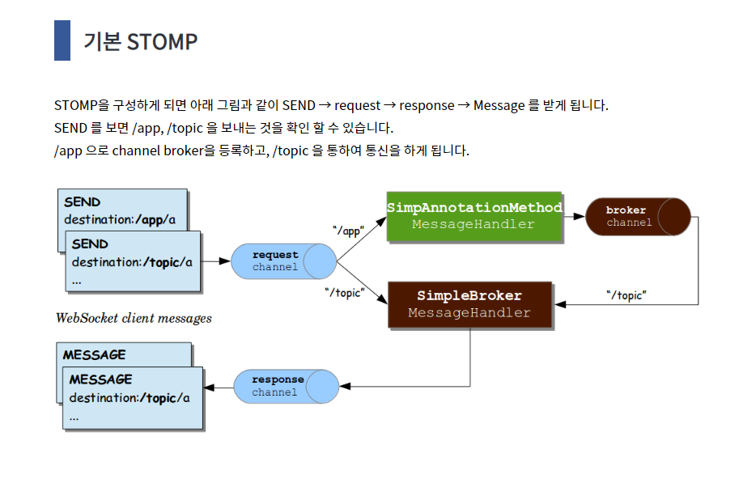

📌 **여기 동운이오빠가 적으면 될듯 !**

---

## 07 협업 툴

- **Gitlab**

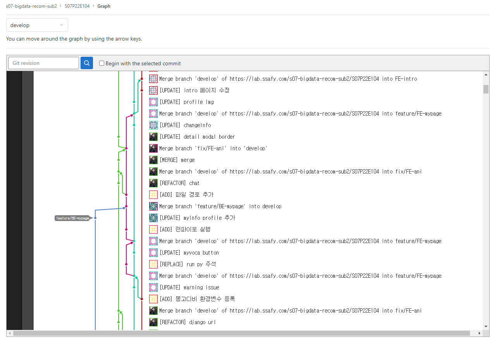

- **Jira**

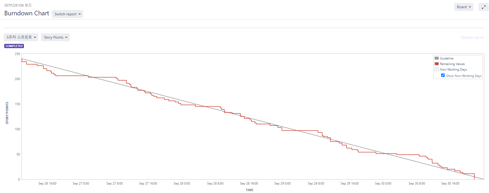

- **Notion**

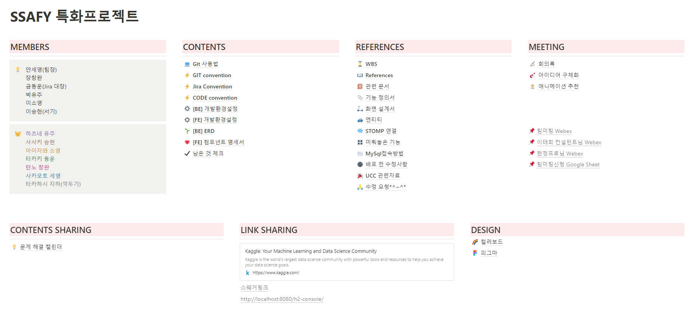

---

## 08 서비스 설계

- **ERD**

  

- **기능 명세서**

- **Figma**

- **컴포넌트 구조 설계**

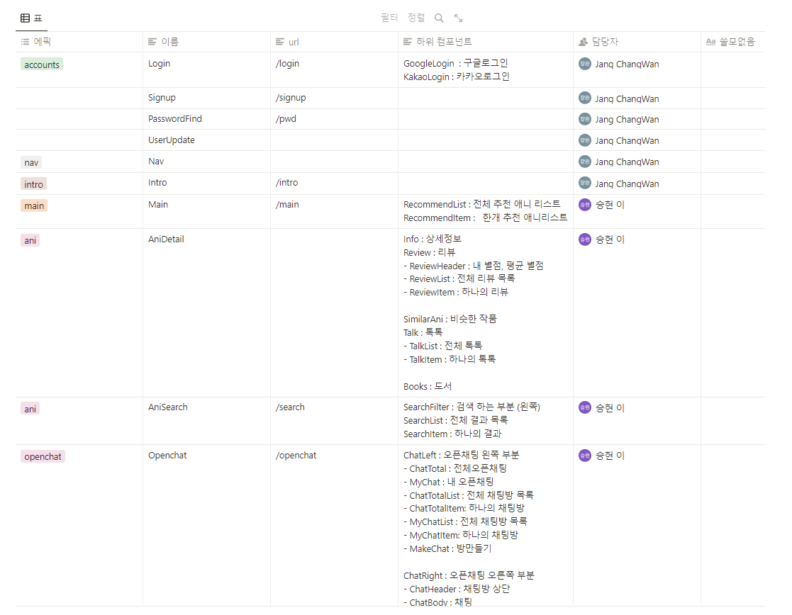

- **Rest API**

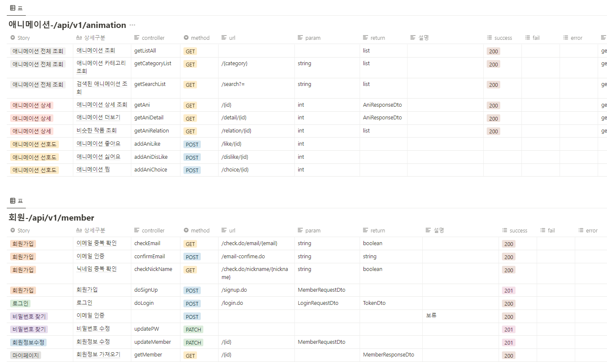